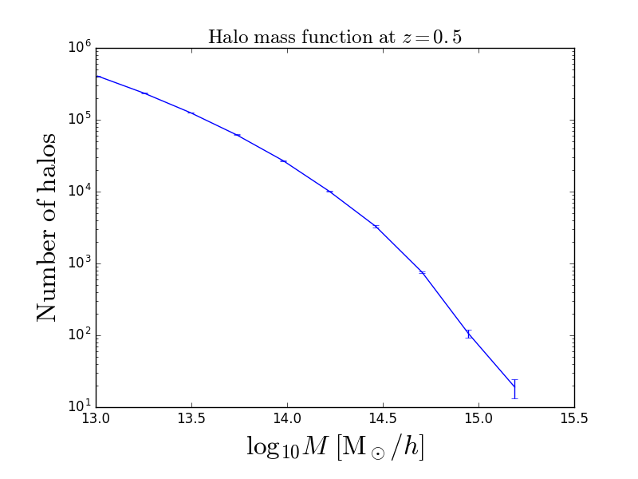
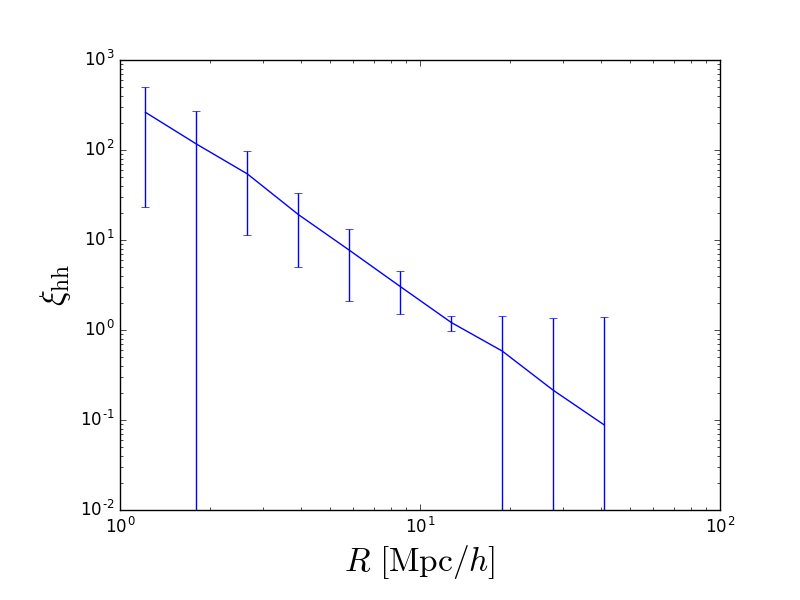

Encore
======
Encore is an afterburner for the Rockstar halo finder. 
Given a path to a list of halos and dark matter particles, 
Encore calculates a plethora of observables.

The structure of this is very similar to the catalog_analysis
code in the repository of the same name, but this is more
ambitious and well thought out.

This code is still in development.

Rockstar Configuration
======================
There is no standard rockstar format file. That is,
in a Rockstar halo catalog, the xyz-positions and masses
for a halo can be in any column. This configuration
must be specified in a "rockstar_config" file.

Usage
=====
Please see the example.py file for how to use Encore.

Currently, jackknifed mass functions and
halo-halo correlation functions are created.
The test data can create jackknifed mass functions:

or halo-halo correlation functions:

The next measureables to be implemented (in order) are:
~~~ 
1. Halo-matter correlation functions
2. Matter-matter correlation functions
3. Sigma profiles
4. DeltaSigma profiles
~~~
