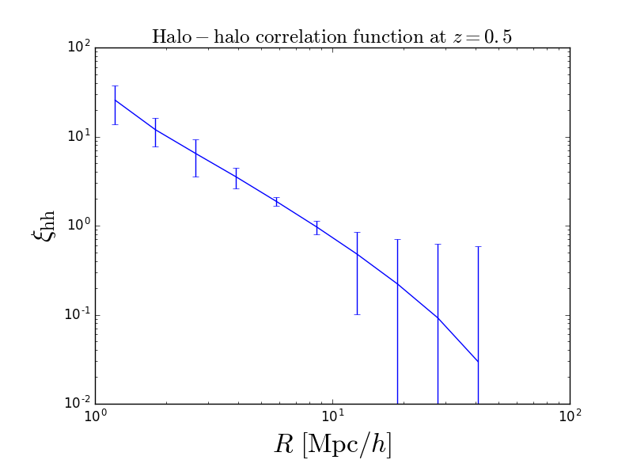

Encore
======
Encore is an afterburner for the Rockstar halo finder. 
Given a path to a list of halos and dark matter particles, 
Encore calculates a plethora of observables.

The structure of this is very similar to the catalog_analysis
code in the repository of the same name, but this is more
ambitious and well thought out.

This code is still in development.

Usage
=====
Currently, jackknifed mass functions and
halo-halo correlation functions are created.
The test data can create jackknifed mass functions:

or halo-halo correlation functions (note: these are posson error bars for now):

The next measureables to be implemented (in order) are:

 Markup : 1. Halo-matter correlation functions
	2. Matter-matter correlation functions
	3. Sigma profiles
	4. DeltaSigma profiles

 Markup : 1. A numbered list
           1. A nested numbered list
           2. Which is numbered
          2. Which is numbered